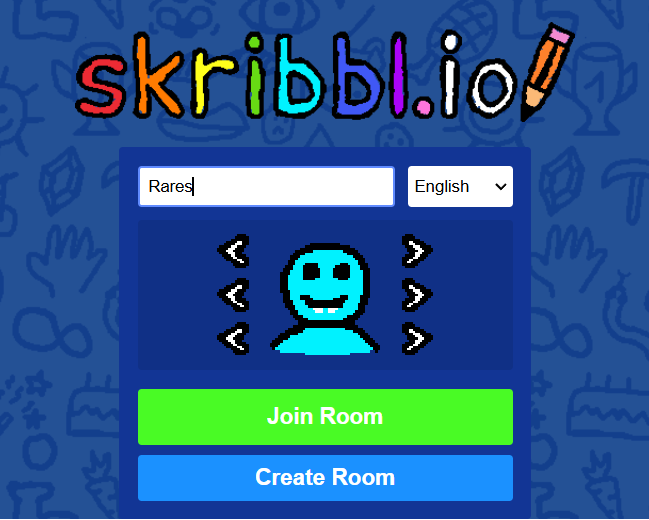
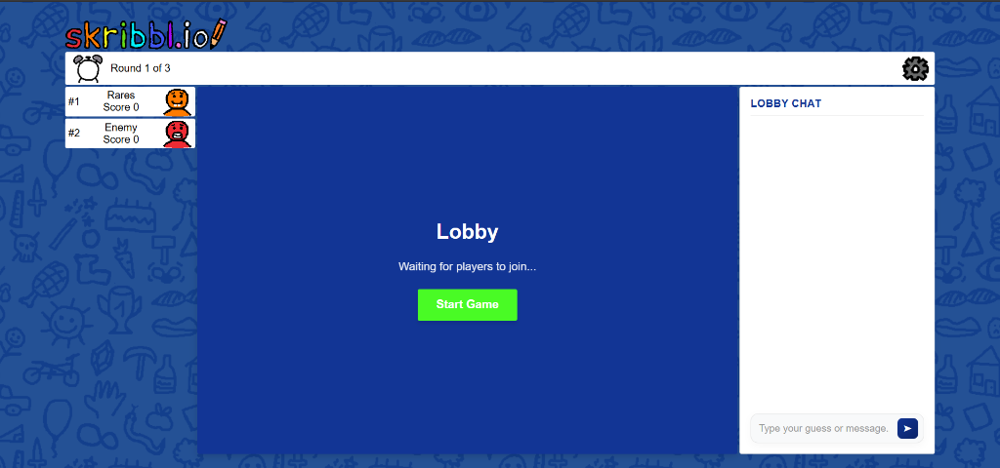
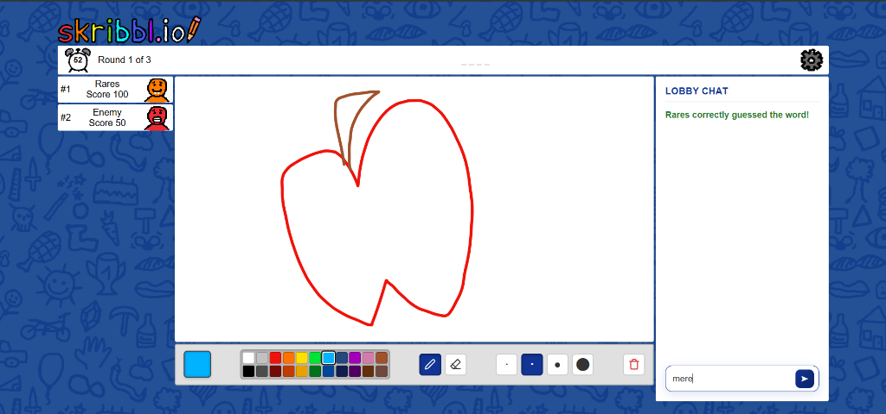
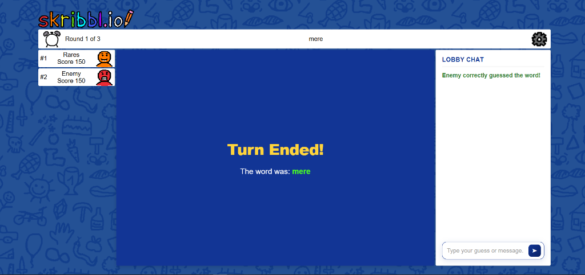
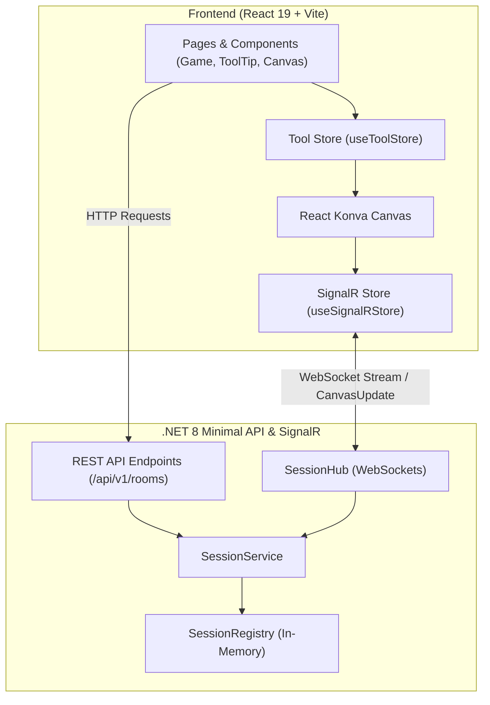

<!-- BEAUTIFIED -->
<!-- AUTO-GENERATED -->
<h1 align="center">Skribbl</h1>

<p align="center">
  <strong>Real-time multiplayer drawing and guessing game web application</strong>
  <br />
  <em>Powered by .NET 8 Minimal API, ASP.NET Core SignalR, React 19, React Konva, and Zustand</em>
</p>

<p align="center">
  <a href="#quick-start"></a>
  <a href="#demo--screenshots"></a>
  <a href="#architecture"></a>
</p>

<p align="center">
  
  
  
  
  
  
</p>

---

## Features / Why

- **Real-Time Canvas Synchronization**: Low-latency drawing updates streamed continuously across game rooms via WebSocket connections using ASP.NET Core SignalR and React Konva.
- **Modular Toolbar & State Management**: Centralized Zustand store (`useToolStore.jsx`) providing 44-color palette selection, dynamic brush sizing (2, 5, 10, and 20px), and seamless pen/eraser mode switching with automatic effective color calculations.
- **Server-Enforced Canvas Actions**: Drawer-authenticated room canvas clearing managed through backend `SessionRegistry` and `SessionService` memory stores.
- **Customizable Player Avatars & Lobbies**: Interactive avatar customizer, username selection, and multi-player room lobbies with automated turn and round tracking.
- **Real-Time Word Guessing & Chat**: Live chat hub validating player word guesses, awarding dynamic scores, and broadcasting turn summaries and leaderboards.

---

## Quick Start

### 1. Clone the repository
```bash
git clone https://github.com/your-username/Skribbl.git
cd Skribbl
```

### 2. Start the .NET Backend
```bash
cd Skribbl
dotnet run
```
*Backend runs on `https://localhost:7064` by default.*

### 3. Start the React Frontend
```bash
cd ../Frontend
npm install
npm run dev
```

### 4. Play the game
Open `http://localhost:5173` in your browser, set up your avatar, create or join a room, and start drawing!

---

## Demo / Screenshots

| 1. Landing & Avatar Selector | 2. Multiplayer Lobby |
| :---: | :---: |
|  |  |
| *Customize avatar & join or create rooms* | *Real-time player tracking & lobby chat* |

| 3. Drawing & Guessing Canvas | 4. Turn Reveal & Scoreboard |
| :---: | :---: |
|  |  |
| *Konva drawing canvas with tool selector & chat* | *Turn summary, word reveal, and score calculation* |

---

## Architecture



---

## Configuration

### Frontend Settings (`Frontend/.env`)
| Variable | Default Value | Description |
| --- | --- | --- |
| `VITE_GAME_URL` | `https://localhost:7064/` | Target backend URL for SignalR WebSocket connection & REST API requests |
| `GAME_URL` | `https://localhost:7064/` | Fallback backend base URL |

### Backend Settings (`Skribbl/appsettings.json`)
| Path | Default Value | Description |
| --- | --- | --- |
| `Logging:LogLevel:Default` | `Information` | Default log reporting verbosity |
| `Logging:LogLevel:Microsoft.AspNetCore` | `Warning` | ASP.NET Core framework log level |
| `AllowedHosts` | `*` | Allowed host names for cross-origin hosting |

---

## API

### REST API Endpoints

| Method | Endpoint | Description |
| --- | --- | --- |
| `POST` | `/api/v1/rooms` | Initialize a new game room session and return room ID |
| `POST` | `/api/v1/rooms/{roomId}/join` | Join an existing room with username and avatar options |
| `GET` | `/api/v1/participants?roomId={id}` | Fetch current participants list sorted by score |
| `GET` | `/api/v1/rooms/{roomId}/canvas` | Retrieve existing canvas stroke updates for a room |

### SignalR Hub Methods & Events (`SessionHub`)

| Direction | Event / Method Name | Payload | Description |
| --- | --- | --- | --- |
| Client → Server | `JoinSignalRGroup` | `{ roomId, username, avatarOptions }` | Connect socket to SignalR group and notify group |
| Client → Server | `SendCanvasUpdate` | `CanvasUpdate` | Broadcast line coordinate stroke data |
| Client → Server | `ClearCanvas` | `roomId` | Clear room canvas history (Drawer authenticated) |
| Client → Server | `SendGuess` | `ChatMessageRequest` | Submit a word guess for validation |
| Server → Client | `CanvasUpdated` | `CanvasUpdate` | Received by non-drawing players to render stroke |
| Server → Client | `CanvasCleared` | `-` | Received by all room players to reset canvas |
| Server → Client | `PlayerJoined` | `Participant` | Broadcast when a new participant enters the room |
| Server → Client | `RecevieMessage` | `ChatMessage` | Broadcast chat messages and correct guess notifications |

---

## Directory Structure

```
Skribbl/
├── docs/
│   └── screenshots/              # Demo screenshots embedded in README
├── Frontend/                     # React 19 Client Application
│   ├── src/
│   │   ├── components/           # Reusable UI components
│   │   ├── features/
│   │   │   ├── AvatarCustomizer/ # Avatar preview & selector
│   │   │   ├── Canvas/           # React Konva interactive drawing canvas
│   │   │   ├── Chat/             # Live chat & word guessing interface
│   │   │   └── ToolTip/          # Color grid, pen/eraser, & size toolbar
│   │   ├── hooks/
│   │   │   ├── useToolStore.jsx  # Zustand store for drawing tools
│   │   │   └── useSignalRStore.jsx # SignalR connection manager
│   │   └── pages/                # Route views (Home, Lobby, Game)
│   ├── package.json
│   └── vite.config.js
├── Skribbl/                      # .NET 8 Backend Server
│   ├── DTO/                      # Request & response data transfer objects
│   ├── Endpoints/                # Game REST API route handlers
│   ├── Hubs/                     # SessionHub SignalR real-time hub
│   ├── Models/                   # Domain models (Participant, Room)
│   ├── Repositories/             # SessionRegistry memory store
│   ├── Services/                 # SessionService business logic
│   ├── Program.cs                # Application entry point & service setup
│   └── Skribbl.csproj
├── PROJECT.md                    # Project feature specs & interface contracts
└── Skribbl.sln                   # Visual Studio Solution File
```

---

## Tech Stack

### Frontend
- **Framework**: React 19 + React Router 7
- **Build Tool**: Vite 8
- **State Management**: Zustand 5
- **Canvas Rendering**: React Konva 19 + Konva 10
- **Real-Time Client**: `@microsoft/signalr` v10

### Backend
- **Framework**: .NET 8 Minimal API
- **Real-Time Server**: ASP.NET Core SignalR Hubs
- **Documentation**: Swagger / OpenAPI (Swashbuckle)

---

## Deployment

### Local Development Setup
1. Ensure **.NET 8 SDK** and **Node.js 18+** are installed.
2. In the `Backend` directory (`Skribbl/`), run:
   ```bash
   dotnet restore
   dotnet run
   ```
3. In the `Frontend/` directory, run:
   ```bash
   npm install
   npm run dev
   ```

---

## Contributing

1. **Fork** the repository
2. **Create** your feature branch (`git checkout -b feature/AmazingFeature`)
3. **Commit** your changes (`git commit -m 'Add some AmazingFeature'`)
4. **Push** to the branch (`git push origin feature/AmazingFeature`)
5. **Open** a Pull Request

---

## License

No LICENSE file detected. Add a LICENSE to clarify project licensing.